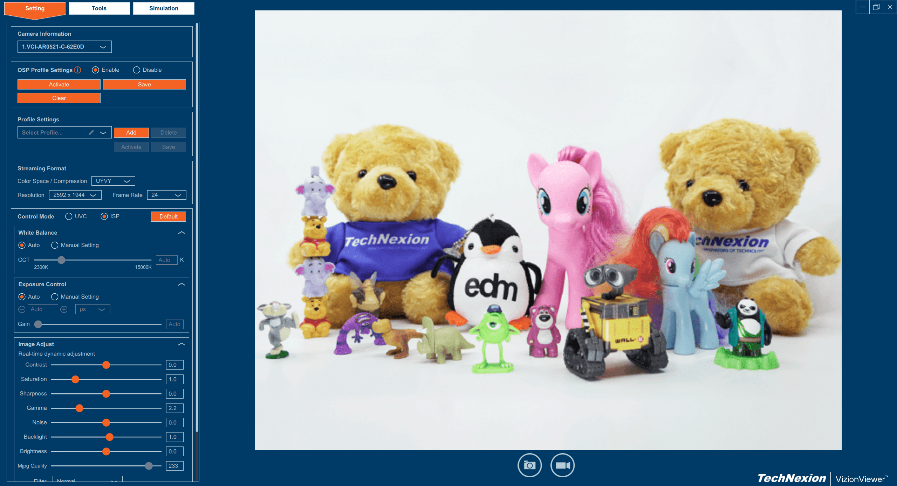

# VizionSDK
VizionSDK is a software development kit designed for Windows and Linux platforms, supporting Technexion AR Series Cameras on various platforms like Windows 10/11, Ubuntu, Yocto, NXP-imx8mp, and Nvidia Jetson. It empowers companies and individuals to easily control these cameras and develop custom applications for diverse purposes.

## What is included in the repository
- Samples : C/C++ samples project source code.
- config : A config file of TechNexion Camera series for VizionSDK to recognize the devices.

## Supported TechNexion Cameras

### MIPI Cameras
- TEVS-AR0144
- TEVS-AR0145
- TEVS-AR0234
- TEVS-AR0521
- TEVS-AR0522
- TEVS-AR0821
- TEVS-AR0822
- TEVS-AR1335

### FPD-LinkIII Cameras

- VLS3-AR0144
- VLS3-AR0145
- VLS3-AR0234
- VLS3-AR0521
- VLS3-AR0522
- VLS3-AR0821
- VLS3-AR0822
- VLS3-AR1335

### UVC Cameras

- VCI-AR0144
- VCI-AR0234
- VCI-AR0521
- VCI-AR0522
- VCI-AR0821
- VCI-AR0822
- VCI-AR1335

## Supported Platforms
- Windows 10/11
- Ubuntu
- NXP i.MX93
- NXP i.MX95
- NXP i.MX8MP
- NXP i.MX8MM
- Jetson Orin Nano (JetPack 5.x/6.x)
- UP Squared Pro 7000
  
## VizionViewer™

VizionViewer™ is a cross-platform camera software for video streaming and image capturing from camera devices with user-friendly Graphical User Interface based on the **VizionSDK**.



### VizionViewer™ Usage Guide
[VizionViewer™ Usage Guide](https://developer.technexion.com/docs/vizionviewer-usage-guide)

### How to Install VizionViewer™

#### X86 Platforms
- [Windows 10 and 11 (64-bit)](https://developer.technexion.com/docs/vizionviewer-installation#windows)
- [Linux (Debian): Ubuntu Desktop 20.04 and 22.04 (64-bit)](https://developer.technexion.com/docs/vizionviewer-installation#linux)
  - Compatible with UP Squared Pro 7000
  - **Note**: When using UP Squared Pro 7000, please add Gstreamer library to environment:
  ```bash
  export GST_PLUGIN_PATH=/usr/lib/gstreamer-1.0
  ```

#### Embedded Platforms
- [NXP-iMX93, NXP-iMX8MP, NXP-iMX8MM (GCC >= 7.5)](https://developer.technexion.com/docs/vizionviewer-installation#nxpimx)
- [NVIDIA-Jetpack5 and Later](https://developer.technexion.com/docs/vizionviewer-installation#nvidiajetpack-5x-and-later)
- [NVIDIA-Jetpack4](https://developer.technexion.com/docs/vizionviewer-installation#nvidiajetpack-4x)
- [TI-TDA4VM](https://developer.technexion.com/docs/vizionviewer-installation#ti)
  
## Documents
- Github Pages：https://github.com/TechNexion
- Overview Document：https://developer.technexion.com/docs/product-category-overview
- API User Guide: https://developer.technexion.com/docs/vizionsdk-overview

## Related links
- [Technexion Main Page](https://www.technexion.com/)
