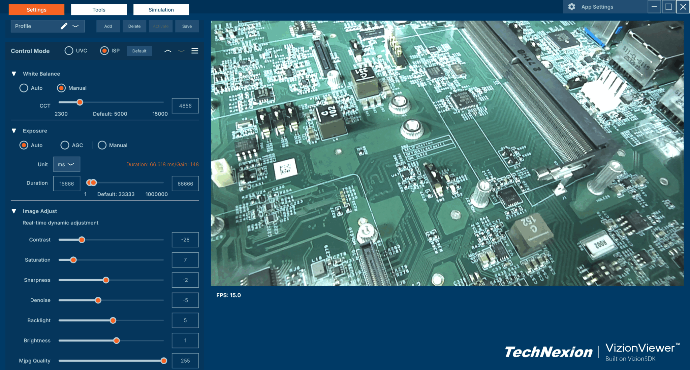

# VizionSDK
VizionSDK is a cross-platform software development kit (SDK) for Windows and Linux, designed to support TechNexion AR Series Cameras across platforms such as Windows 10/11, Ubuntu, Yocto, NXP i.MX, and NVIDIA Jetson. It enables developers and companies to easily integrate, control, and build custom applications using these cameras.

## What is included in the repository
- `samples/` : C++ samples project source code.
- `config/` : A config file of TechNexion Camera series for VizionSDK to recognize the devices.

## Supported Platforms

#### [Windows x64](https://developer.technexion.com/docs/vision-software/vizionsdk/cplusplus/vizionsdk-cpp-installation#windows-x64)
- Windows 10 and 11 (64-bit)
#### [Linux x64](https://developer.technexion.com/docs/vision-software/vizionsdk/cplusplus/vizionsdk-cpp-installation#linux-x64)
- Ubuntu Desktop 20.04 and 22.04 (64-bit)
- UP Squared Pro 7000
#### [Linux ARM64](https://developer.technexion.com/docs/vision-software/vizionsdk/cplusplus/vizionsdk-cpp-installation#linux-arm64)
- NVIDIA Jetson (JetPack 6 or later)
- NXP-i.MX8MM, NXP-i.MX8MQ, NXP-i.MX8MP, NXP-i.MX93, NXP-i.MX95
- TI-TDA4VM

## Supported TechNexion Cameras

| Sensor | MIPI           | FPD-LinkIII      | UVC            | GMSL2            |
|--------|----------------|------------------|----------------|------------------|
| AR0144 | ✓ TEVS-AR0144  | ✓ VLS3-AR0144    | ✓ VCI-AR0144   | ✓ VLS-GM2-AR0144 |
| AR0145 | ✓ TEVS-AR0145  | ✓ VLS3-AR0145    |                | ✓ VLS-GM2-AR0145 |
| AR0234 | ✓ TEVS-AR0234  | ✓ VLS3-AR0234    | ✓ VCI-AR0234   | ✓ VLS-GM2-AR0234 |
| AR0521 | ✓ TEVS-AR0521  | ✓ VLS3-AR0521    | ✓ VCI-AR0521   | ✓ VLS-GM2-AR0521 |
| AR0522 | ✓ TEVS-AR0522  | ✓ VLS3-AR0522    | ✓ VCI-AR0522   | ✓ VLS-GM2-AR0522 |
| AR0821 | ✓ TEVS-AR0821  | ✓ VLS3-AR0821    | ✓ VCI-AR0821   | ✓ VLS-GM2-AR0821 |
| AR0822 | ✓ TEVS-AR0822  | ✓ VLS3-AR0822    | ✓ VCI-AR0822   | ✓ VLS-GM2-AR0822 |
| AR1335 | ✓ TEVS-AR1335  | ✓ VLS3-AR1335    | ✓ VCI-AR1335   | ✓ VLS-GM2-AR1335 |

## Supported Languages & Wrappers

| Language | Installation Guide | Sample Repository | Platform |
|-----------|--------------------|-------------------|-----------|
| **C++** | [Install VizionSDK-C++](https://developer.technexion.com/docs/vision-software/vizionsdk/cplusplus/vizionsdk-cpp-installation) | [samples (C++)](https://github.com/TechNexion-Vision/vizionsdk/tree/main/samples) | Windows / Linux |
| **C** | [Install VizionSDK-C](https://developer.technexion.com/docs/vision-software/vizionsdk/c/vizionsdk-c-installation) | [vizionsdk-c-sample](https://github.com/TechNexion-Vision/vizionsdk-c/tree/main/samples) | Windows / Linux |
| **Python** | [Install VizionSDK-Python](https://developer.technexion.com/docs/vision-software/vizionsdk/python/pyvizionsdk-installation) | [pyvizionsdk-samples](https://github.com/TechNexion-Vision/vizionsdk-python/tree/main/samples) | Windows / Linux |
| **C#** | [Install VizionSDK-C#](https://developer.technexion.com/docs/vision-software/vizionsdk/csharp/csvizionsdk-installation) | [vizionsdk-csharp-samples](https://github.com/TechNexion-Vision/vizionsdk-csharp/tree/main/samples) | Windows only |

## Documentation
#### Developer Guides
- [VizionSDK Overview](https://developer.technexion.com/docs/vision-software/vizionsdk/)
- [VizionSDK API User Guide](https://developer.technexion.com/docs/category/recommended-api-v25041)

#### Integration Samples
- [vizionsdk-opencv](https://github.com/TechNexion-Vision/vizionsdk-opencv) – Example project showing how to integrate VizionSDK with OpenCV.

## vizion-ctl

[vizion-ctl](https://developer.technexion.com/docs/vision-software/vizionsdk/vizion-ctl/vizionctl-overview) is a cross-platform command-line tool for controlling TechNexion cameras.

It supports camera parameter control, information retrieval, and firmware updates via terminal commands.

Two versions are available:
- **[vizion-ctl](https://developer.technexion.com/docs/vision-software/vizionsdk/vizion-ctl/)** – uses the C++ `VizionSDK`
- **[pyvizion-ctl](https://developer.technexion.com/docs/vision-software/vizionsdk/vizion-ctl/pyvizion-ctl)** – uses the Python `pyvizionsdk`
##### (Note: pyvizion-ctl currently does not support firmware updates.)

## VizionViewer™

[VizionViewer™](https://developer.technexion.com/docs/vision-software/vizionviewer/) is a cross-platform camera software for video streaming and image capturing from camera devices with user-friendly Graphical User Interface based on the **VizionSDK**.

## Related links
- [TechNexion Main Page](https://www.technexion.com/)
- [TechNexion Github](https://github.com/TechNexion)
